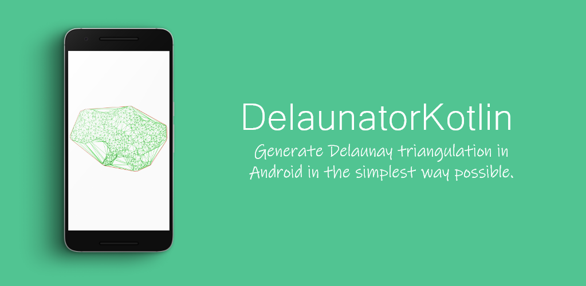

# DelaunatorKotlin
Simple library for generate [Delaunay triangulation](https://en.wikipedia.org/wiki/Delaunay_triangulation#:~:text=In%20mathematics%20and%20computational%20geometry,triangle%20in%20DT(P).) written in Kotlin

<p align="center">
    
</p>
 
## About
DelaunatorKotlin is an incredibly fast Kotlin library for Delaunay triangulation of 2D points. The library is a port from the original [DelaunatorJavaScript](https://github.com/mapbox/delaunator) library. To learn more about how exactly the library work you can check the official guid page [HERE](https://slaviboy.github.io/DelaunatorKotlin/).

[](http://developer.android.com/index.html)
[](https://android-arsenal.com/api?level=21)
[](https://github.com/slaviboy/DelaunatorKotlin/releases/tag/v.0.1.0)

## Add to your project
Add the jitpack maven repository
```
allprojects {
  repositories {
    ...
    maven { url 'https://jitpack.io' }
  }
}
``` 
Add the dependency
```
dependencies {
  implementation 'com.github.slaviboy:DelaunatorKotlin:v.0.1.0'
}
```
 
### How to use
Create Delaunator object by passing your points coordinates in a form of FloatArray that holds the x,y coordinate pair for each point. After that you can get the half-edges indices using the **halfEdges** array, or get the hull indices using the **hull** array. Below is an example how to generate the delaunay triangulation:
```kotlin

// make sure you add at least 3 pairs of x,y coordinates
val coordinates: DoubleArray = doubleArrayOf(
    19.0, 93.0,   // first point 
    1.0, 64.0,    // second point 
    23.0, 93.0,   // third point
    192.0, 43.0,  // fourth point
    14.0, 2.0     // fifth point
)

// create delaunator
val delaunator: Delaunator = Delaunator(*coordinates)

// get hull, halfEdges and triangles indices
val halfEdges: IntArray = delaunator.halfEdges
val hull: IntArray = delaunator.hull
var triangles: IntArray = delaunator.triangles
```
 
If you want to visualise the delaunay triangulation in a View, you can check the available example on creating custom view that draws the **hull**, **halfEdges** and **point coordinates** for particular amount of points [HERE](https://github.com/slaviboy/DelaunatorKotlin/blob/master/app/src/main/java/com/slaviboy/delaunatorkotlinexample/DelaunatorView.kt).
 
